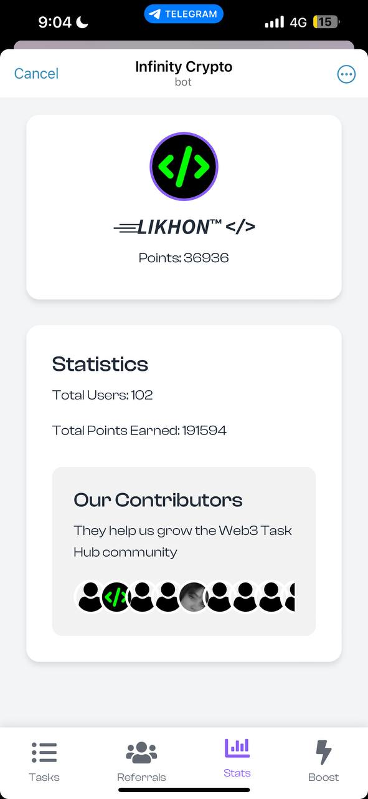
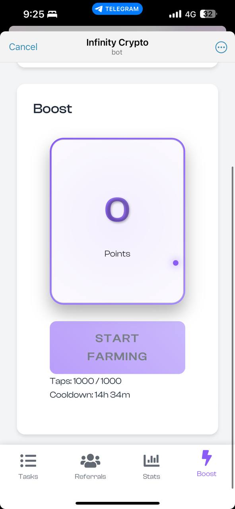
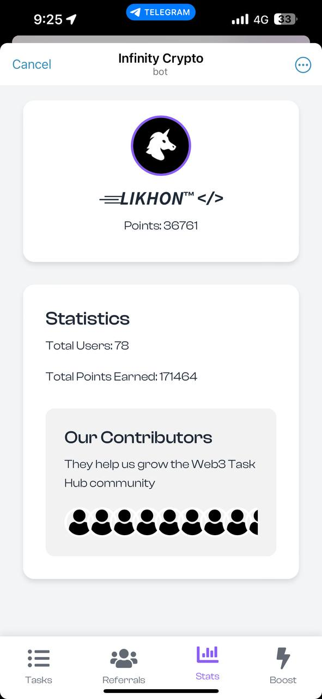

<p align="center">
  
  
  
  
  
  
</p>

<p align="center">
  
</p>

A Telegram bot and web application for engaging users in cryptocurrency and Web3 technologies.

## 🌟 Features

- User profile management
- Referral system with rewards
- Daily tasks and point system
- Interactive web app interface
- Community statistics and leaderboard
- Boost feature for extra points

## 🛠️ Tech Stack

<p align="center">
  
  
  
  
  
  
</p>

## 📊 Project Stats

<p align="center">
  
  
  
</p>

## 📁 Project Structure

```
Infinity-Web3-Crypto-Bot/
├── frontend/
├── screenshots/
│   ├── 1.jpg
│   ├── 2.jpg
│   └── 3.jpg
└── README.md
```

## 🚀 Quick Start

1. Clone the repository:
   ```bash
   git clone https://github.com/nectariferous/Infinity-Web3-Crypto-Bot.git
   cd Infinity-Web3-Crypto-Bot
   ```
2. Install dependencies:
   ```bash
   npm install
   pip install -r requirements.txt
   ```
3. Set up environment variables:
   ```bash
   cp .env.example .env
   # Edit .env with your configuration
   ```
4. Start the server:
   ```bash
   npm start
   ```
5. Launch the bot:
   ```bash
   python bot.py
   ```

## 🤝 Contributing

We welcome contributions! Please see our [Contribution Guidelines](CONTRIBUTING.md) for more details.

<a href="https://github.com/nectariferous/Infinity-Web3-Crypto-Bot/graphs/contributors">
  
</a>

## 📸 Screenshots

<p align="center">
  
  
  
</p>

## 📈 Project Activity

<p align="center">
  
</p>

## 💖 Support

If you find this project helpful:

```
ETH: 0x3A06322e9F1124F6B2de8F343D4FDce4D1009869
```

<a href="https://t.me/nectariferous">
  
</a>

## 📜 License

This project is licensed under the MIT License - see the [LICENSE](LICENSE) file for details.

## 🙏 Acknowledgements

- [Telegram Bot API](https://core.telegram.org/bots/api)
- [Node.js](https://nodejs.org/)
- [Python](https://www.python.org/)
- [MongoDB](https://www.mongodb.com/)
- All our amazing contributors!
